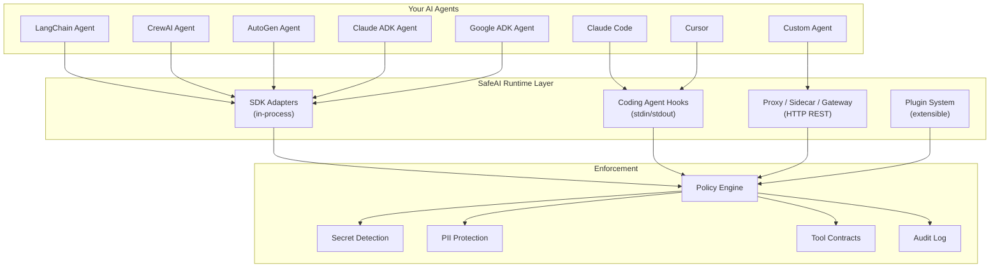
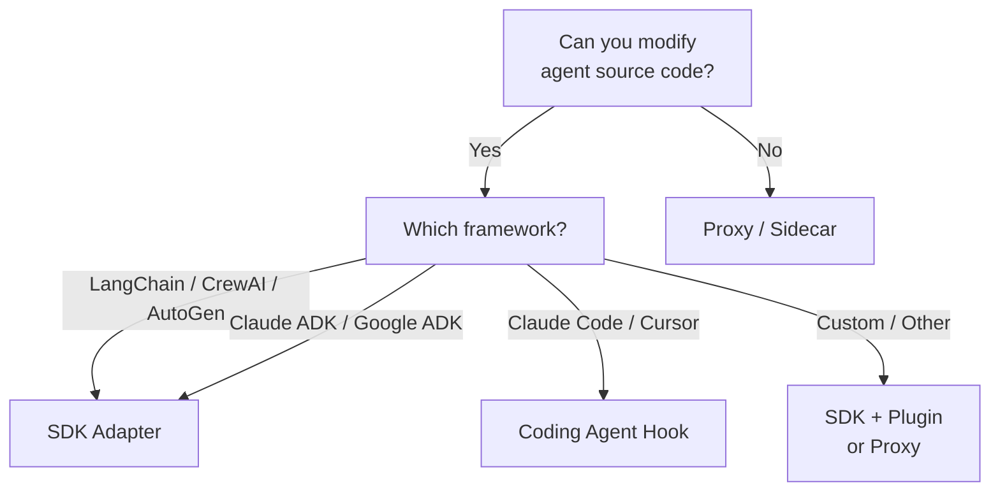

# Integrations Overview

SafeAI is **framework-agnostic** -- it works with any AI agent framework, coding assistant, or deployment topology. Choose the integration mode that fits your stack.

---

## Integration Modes



---

## SDK Adapters (In-Process)

Embed SafeAI directly inside your agent process. Each adapter wraps your framework's tool-calling interface so every invocation passes through SafeAI's policy engine.

| Framework | Adapter | Page |
|-----------|---------|------|
| LangChain | `ai.langchain_adapter()` | [LangChain](langchain.md) |
| CrewAI | `ai.crewai_adapter()` | [CrewAI](crewai.md) |
| AutoGen | `ai.autogen_adapter()` | [AutoGen](autogen.md) |
| Claude ADK | `ai.claude_adk_adapter()` | [Claude ADK](claude-adk.md) |
| Google ADK | `ai.google_adk_adapter()` | [Google ADK](google-adk.md) |

```python
from safeai import SafeAI

ai = SafeAI()
adapter = ai.langchain_adapter()          # or crewai_adapter(), autogen_adapter(), etc.
safe_tool = adapter.wrap_tool("my_tool", tool_fn, agent_id="agent-1")
```

!!! tip "3 lines to integrate"
    Every SDK adapter follows the same pattern: **create SafeAI** -> **get adapter** -> **wrap tools**. Your existing framework code stays unchanged.

---

## Coding Agent Hooks

For AI-powered coding assistants that support shell hooks or MCP, SafeAI provides first-class setup commands.

| Agent | Command | Page |
|-------|---------|------|
| Claude Code | `safeai setup claude-code` | [Coding Agents](coding-agents.md) |
| Cursor | `safeai setup cursor` | [Coding Agents](coding-agents.md) |
| MCP clients | `safeai mcp` | [Coding Agents](coding-agents.md) |
| Any agent | `safeai hook` | [Coding Agents](coding-agents.md) |

```bash
# One command to protect your coding agent
safeai setup claude-code
```

!!! info "How hooks work"
    The `safeai hook` command reads a JSON action from **stdin**, evaluates it against the active policy, and writes a JSON decision to **stdout**. This simple protocol works with any agent that supports shell-based tool approval.

---

## Proxy / Sidecar / Gateway

Run SafeAI as a standalone HTTP service. Perfect for polyglot environments, multi-agent deployments, or when you cannot modify agent source code.

| Mode | Command | Use Case |
|------|---------|----------|
| Sidecar | `safeai serve --mode sidecar --port 8000` | Single-agent, same host |
| Gateway | `safeai serve --mode gateway` | Multi-agent, centralized enforcement |

```bash
# Start a sidecar next to your agent
safeai serve --mode sidecar --port 8000

# Scan input from any language
curl -X POST http://localhost:8000/v1/scan/input \
  -H "Content-Type: application/json" \
  -d '{"text": "Process this request"}'
```

See [Proxy / Sidecar](proxy-sidecar.md) for full endpoint reference.

---

## Plugin System

Extend SafeAI with custom detectors, adapters, and policy templates -- no forking required.

```python
# plugins/my_plugin.py
def safeai_detectors():
    return [MyCustomDetector()]

def safeai_adapters():
    return {"my_adapter": MyAdapter}
```

```yaml
# safeai.yaml
plugins:
  enabled: true
  plugin_files:
    - "plugins/*.py"
```

See [Plugins](plugins.md) for the full plugin API.

---

## Choosing the Right Mode



| Criteria | SDK Adapter | Coding Hook | Proxy/Sidecar |
|----------|:-----------:|:-----------:|:-------------:|
| Latency | Lowest (in-process) | Low (subprocess) | Medium (HTTP) |
| Language support | Python only | Any (JSON protocol) | Any (HTTP) |
| Source code changes | Required | None | None |
| Multi-agent | Per-agent adapter | Per-agent hook | Centralized gateway |
| Metrics | In-process | CLI output | Prometheus endpoint |

---

## Next Steps

- [Getting Started](../getting-started/quickstart.md) -- install SafeAI and run your first scan
- [Policy Engine](../guides/policy-engine.md) -- configure what SafeAI enforces
- [Audit Logging](../guides/audit-logging.md) -- track every decision
