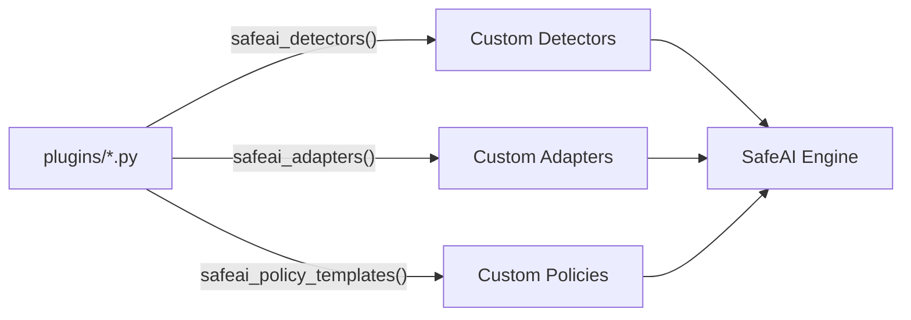

# Plugin System

Extend SafeAI with custom detectors, adapters, and policy templates -- no forking required. Drop a Python file into your project, enable plugins in config, and SafeAI loads your extensions at startup.

---

## How Plugins Work



A plugin is a Python file that exports one or more **well-known functions**. SafeAI discovers and loads these functions at startup.

---

## Quick Start

### 1. Create a Plugin File

```python
# plugins/my_plugin.py

def safeai_detectors():
    """Return a list of custom detector instances."""
    return [PhoneNumberDetector()]

class PhoneNumberDetector:
    name = "phone_number"
    description = "Detects phone numbers in text"
    severity = "medium"

    def detect(self, text: str) -> list:
        import re
        pattern = r'\b\d{3}[-.]?\d{3}[-.]?\d{4}\b'
        matches = re.findall(pattern, text)
        return [
            {
                "type": "pii_detected",
                "detector": self.name,
                "severity": self.severity,
                "match": m,
            }
            for m in matches
        ]
```

### 2. Enable Plugins in Config

```yaml
# safeai.yaml
plugins:
  enabled: true
  plugin_files:
    - "plugins/*.py"
```

### 3. Use SafeAI as Normal

```python
from safeai import SafeAI

ai = SafeAI.from_config("safeai.yaml")

# Your custom detector is now active
result = ai.scan("Call me at 555-123-4567")
# -> detects phone number via your plugin
```

---

## Supported Exports

Each plugin file can export any combination of these functions:

### `safeai_detectors()`

Return a list of detector instances. Each detector must have a `detect(text: str) -> list` method.

```python
def safeai_detectors():
    return [
        CreditCardDetector(),
        InternalURLDetector(),
        CustomPatternDetector(pattern=r"INTERNAL-\d{6}"),
    ]
```

### `safeai_adapters()`

Return a dictionary mapping adapter names to adapter classes. These become available via `ai.plugin_adapter(name)`.

```python
def safeai_adapters():
    return {
        "slack": SlackAdapter,
        "discord": DiscordAdapter,
    }

class SlackAdapter:
    def __init__(self, safeai):
        self.safeai = safeai

    def wrap_tool(self, name, tool, agent_id=None):
        # ... wrapping logic ...
        pass
```

### `safeai_policy_templates()`

Return a dictionary of named policy templates that users can reference in their config.

```python
def safeai_policy_templates():
    return {
        "hipaa_strict": {
            "secret_detection": {"enabled": True},
            "pii_protection": {
                "enabled": True,
                "action": "block",
                "types": ["ssn", "medical_record", "insurance_id"],
            },
        },
        "financial_compliance": {
            "secret_detection": {"enabled": True},
            "pii_protection": {
                "enabled": True,
                "action": "redact",
                "types": ["credit_card", "bank_account", "ssn"],
            },
        },
    }
```

---

## Plugin Discovery API

SafeAI provides methods to inspect loaded plugins at runtime:

```python
from safeai import SafeAI

ai = SafeAI.from_config("safeai.yaml")

# List all loaded plugins
plugins = ai.list_plugins()
for p in plugins:
    print(f"{p.name}: {p.file_path}")

# List adapters contributed by plugins
adapters = ai.list_plugin_adapters()
for name, cls in adapters.items():
    print(f"  adapter: {name} -> {cls}")

# Get a plugin adapter by name
slack = ai.plugin_adapter("slack")
safe_tool = slack.wrap_tool("post_message", post_fn, agent_id="bot")
```

---

## Full Plugin Example

Here is a complete plugin that adds a credit card detector, a custom adapter, and a compliance policy template:

```python
# plugins/compliance_plugin.py
"""
SafeAI compliance plugin.
Adds PCI-DSS focused detectors and a Slack adapter.
"""

import re


# ---------- Detectors ----------

class CreditCardDetector:
    name = "credit_card"
    description = "Detects credit card numbers (Luhn-validated)"
    severity = "critical"

    def detect(self, text: str) -> list:
        pattern = r'\b(?:\d[ -]*?){13,19}\b'
        candidates = re.findall(pattern, text)
        violations = []
        for c in candidates:
            digits = re.sub(r'\D', '', c)
            if self._luhn_check(digits):
                violations.append({
                    "type": "pii_detected",
                    "detector": self.name,
                    "severity": self.severity,
                    "match": c.strip(),
                })
        return violations

    @staticmethod
    def _luhn_check(num: str) -> bool:
        total = 0
        for i, d in enumerate(reversed(num)):
            n = int(d)
            if i % 2 == 1:
                n *= 2
                if n > 9:
                    n -= 9
            total += n
        return total % 10 == 0


class IBANDetector:
    name = "iban"
    description = "Detects International Bank Account Numbers"
    severity = "high"

    def detect(self, text: str) -> list:
        pattern = r'\b[A-Z]{2}\d{2}[A-Z0-9]{4,30}\b'
        matches = re.findall(pattern, text)
        return [
            {
                "type": "pii_detected",
                "detector": self.name,
                "severity": self.severity,
                "match": m,
            }
            for m in matches
        ]


# ---------- Adapters ----------

class SlackAdapter:
    """Wraps Slack bot tool calls with SafeAI enforcement."""

    def __init__(self, safeai):
        self.safeai = safeai

    def wrap_tool(self, name, tool, agent_id=None):
        def wrapped(*args, **kwargs):
            # Scan inputs
            input_text = str(args) + str(kwargs)
            scan = self.safeai.scan(input_text)
            if scan.blocked:
                raise RuntimeError(f"SafeAI blocked: {scan.reason}")

            # Execute
            result = tool(*args, **kwargs)

            # Guard output
            output_text = str(result)
            guard = self.safeai.guard(output_text)
            if guard.modified:
                return guard.modified_text
            return result

        return wrapped


# ---------- Exported Functions ----------

def safeai_detectors():
    return [CreditCardDetector(), IBANDetector()]


def safeai_adapters():
    return {"slack": SlackAdapter}


def safeai_policy_templates():
    return {
        "pci_dss": {
            "secret_detection": {"enabled": True},
            "pii_protection": {
                "enabled": True,
                "action": "block",
                "types": ["credit_card", "iban"],
            },
        },
    }
```

---

## Plugin Configuration Reference

```yaml
# safeai.yaml
plugins:
  enabled: true                      # master switch
  plugin_files:                      # glob patterns for plugin files
    - "plugins/*.py"
    - "safeai_plugins/**/*.py"
  auto_discover: true                # scan installed packages for entry points
```

!!! warning "Security"
    Plugins execute arbitrary Python code. Only load plugins from trusted sources. SafeAI does **not** sandbox plugin execution.

---

## Plugin File Structure

A recommended project layout:

```
my-project/
  safeai.yaml
  plugins/
    __init__.py           # optional
    compliance_plugin.py  # detectors + adapters
    custom_rules.py       # policy templates
  src/
    main.py
```

---

## Next Steps

- [Policy Engine](../guides/policy-engine.md) -- use plugin-provided policy templates
- [Secret Detection](../guides/secret-detection.md) -- see how detectors integrate
- [API Reference - Middleware](../reference/middleware.md) -- adapter interface details
